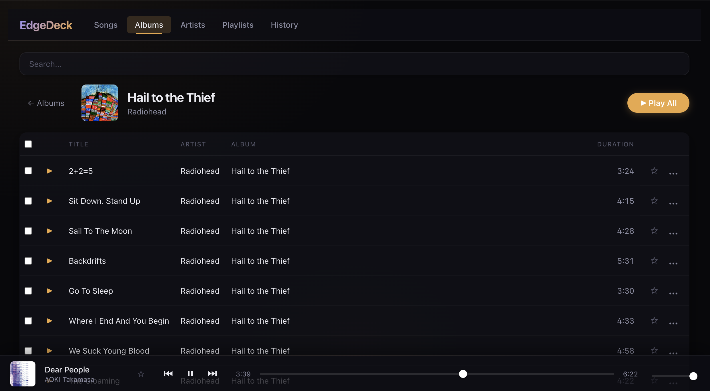

# EdgeDeck

A personal music streaming PWA built on the Cloudflare ecosystem (Workers, D1, R2).

<p align="center">
  
</p>

## Features

- Stream your music library from anywhere via browser
- PWA support for mobile and desktop (offline-capable service worker)
- Metadata extraction (ID3 tags, artwork)
- Playlists, star/favorite, play history
- Album / Artist browsing
- Responsive UI (mobile-friendly)
- Media Session API integration (lock screen controls)
- Playback persistence across page reloads
- File deduplication by SHA-256 hash
- Protected by Cloudflare Zero Trust Access

## Tech Stack

| Layer    | Technology                      |
| -------- | ------------------------------- |
| Frontend | Vite + React + TypeScript (PWA) |
| Backend  | Cloudflare Workers + Hono       |
| Database | Cloudflare D1 (SQLite)          |
| Storage  | Cloudflare R2                   |
| Auth     | Cloudflare Zero Trust Access    |
| IaC      | Terraform                       |
| CI       | GitHub Actions                  |

## Prerequisites

- [Node.js](https://nodejs.org/) (v22+)
- [Wrangler CLI](https://developers.cloudflare.com/workers/wrangler/) (included in devDependencies)
- [Terraform](https://www.terraform.io/) (v1.0+)
- [ffmpeg / ffprobe](https://ffmpeg.org/) (for music upload)
- A Cloudflare account with a domain managed by Cloudflare DNS

## Deployment

### 1. Install dependencies

```bash
npm install
```

### 2. Create a Cloudflare API Token

Go to **Cloudflare Dashboard > My Profile > API Tokens > Create Token > Custom token**.

Required permissions:

| Scope   | Permission                                            | Level |
| ------- | ----------------------------------------------------- | ----- |
| Account | Workers Scripts                                       | Edit  |
| Account | Workers R2 Storage                                    | Edit  |
| Account | D1                                                    | Edit  |
| Account | Access: Apps and Policies                             | Edit  |
| Account | Access: Organizations, Identity Providers, and Groups | Edit  |
| Account | Account Settings                                      | Read  |
| Zone    | Workers Routes                                        | Edit  |

Restrict the token to your specific account and zone.

### 3. Provision infrastructure with Terraform

```bash
cd terraform
cp terraform.tfvars.example terraform.tfvars
```

Edit `terraform.tfvars`:

| Variable               | Description                          | Where to find                                             |
| ---------------------- | ------------------------------------ | --------------------------------------------------------- |
| `cloudflare_api_token` | API token created above              | Step 2                                                    |
| `account_id`           | Cloudflare Account ID                | Dashboard > domain Overview > right sidebar "API" section |
| `zone_id`              | Cloudflare Zone ID                   | Same location as Account ID                               |
| `allowed_email`        | Your email for Access login          | Your email address                                        |
| `app_domain`           | Subdomain (e.g. `music.example.com`) | Must be under your Cloudflare-managed domain              |

```bash
terraform init
terraform plan
terraform apply
```

This creates:

- **R2 bucket** for music file storage
- **D1 database** for metadata
- **Cloudflare Access** application with email and service token policies

### 4. Configure wrangler.toml

```bash
cp wrangler.toml.example wrangler.toml
```

Edit `wrangler.toml`:

- Set `database_id` to your D1 database ID (run `wrangler d1 list` to find it)
- Set `pattern` in `routes` to your `app_domain` value (e.g. `music.example.com`)

### 5. Authenticate Wrangler

```bash
wrangler login
```

### 6. Apply database migrations

```bash
wrangler d1 migrations apply DB --remote
```

### 7. Deploy

```bash
npm run deploy
```

This builds the frontend and deploys the Worker to Cloudflare. Your app will be available at the custom domain configured in step 4.

## Uploading Music

The `scripts/upload.sh` script uploads music files to your instance. It extracts metadata and artwork using ffmpeg, uploads files to R2, and registers them in D1.

### Local upload

```bash
./scripts/upload.sh ~/Music
```

### Production upload

Production requires a Cloudflare Access **Service Token** for authentication:

1. Go to **Cloudflare Dashboard > Zero Trust > Access > Service Auth > Service Tokens**
2. Click **Create Service Token**
3. Save the `Client ID` and `Client Secret` (the secret is only shown once)

```bash
export CF_ACCESS_CLIENT_ID="<your-client-id>"
export CF_ACCESS_CLIENT_SECRET="<your-client-secret>"
./scripts/upload.sh ~/Music https://music.example.com
```

The script will:

- Scan for music files and compute SHA-256 hashes
- Skip already-uploaded files (deduplication by hash)
- Convert unsupported formats (ALAC, APE, etc.) to AAC automatically
- Extract and upload cover artwork
- Register metadata in D1

### Upload dependencies

`ffmpeg`, `ffprobe`, `curl`, `jq`

## Local Development

```bash
npm run db:migrate   # Apply D1 migrations locally
npm run dev:worker   # Start Wrangler backend (port 8787)
npm run dev          # Start Vite dev server (port 5173)
npm test             # Run tests (vitest)
npm run test:watch   # Run tests in watch mode
npm run lint         # ESLint
npm run format       # Prettier (write)
npm run format:check # Prettier (check only)
```

Open `http://localhost:5173`. The Vite dev server proxies `/api/*` to the Wrangler backend.

### Uploading music locally

Use `wrangler r2 object put` with the `--local` flag:

```bash
npx wrangler r2 object put "edgedeck-music/Artist/Album/song.flac" \
  --file="./song.flac" --local
```

Or use the upload script against the local backend:

```bash
./scripts/upload.sh ~/Music
```

## Supported Audio Formats

| Format     | Browser Support                                   |
| ---------- | ------------------------------------------------- |
| MP3        | All browsers                                      |
| FLAC       | All browsers                                      |
| M4A (AAC)  | All browsers                                      |
| M4A (ALAC) | **Safari only** — Chrome/Firefox cannot play ALAC |
| OGG        | All browsers                                      |
| WAV        | All browsers                                      |
| OPUS       | All browsers                                      |

ALAC files are automatically converted to AAC by the upload script. For manual conversion:

```bash
ffmpeg -i input.m4a -c:a flac output.flac
```

## Free Tier Limits

This project runs within Cloudflare's free tier for most personal use:

| Service    | Free Tier                         | Note                                  |
| ---------- | --------------------------------- | ------------------------------------- |
| Workers    | 100K requests/day                 | Sufficient for personal use           |
| D1         | 5GB storage, 5M reads/day         | Sufficient for metadata               |
| R2         | **10GB storage**, 10M reads/month | May exceed with large music libraries |
| Zero Trust | 50 users                          | 1 seat for personal use               |

R2 storage is the most likely limit to hit. FLAC albums are typically 300–700MB, so ~15–30 albums will reach 10GB. Beyond that, R2 charges $0.015/GB/month for additional storage.

## Project Structure

```
edgedeck/
├── src/
│   ├── api/
│   │   ├── routes/          # Hono route handlers
│   │   ├── repositories/    # Data access (D1 + in-memory for tests)
│   │   ├── services/        # Metadata parsing
│   │   ├── middleware/       # Auth middleware
│   │   └── types.ts         # Repository interfaces
│   ├── app/
│   │   ├── pages/           # Library (Songs/Albums/Artists/Playlists/History)
│   │   ├── components/      # Player, SongList, SearchBar
│   │   └── hooks/           # useAudioPlayer, useMediaSession, usePlaybackPersistence
│   └── worker.ts            # Worker entry point
├── migrations/              # D1 schema migrations
├── terraform/               # Infrastructure definitions
├── scripts/                 # Upload script
├── public/                  # PWA manifest, service worker, icons
├── .github/workflows/       # CI (lint, format, Terraform validate)
└── wrangler.toml.example    # Wrangler config template
```

## License

MIT
